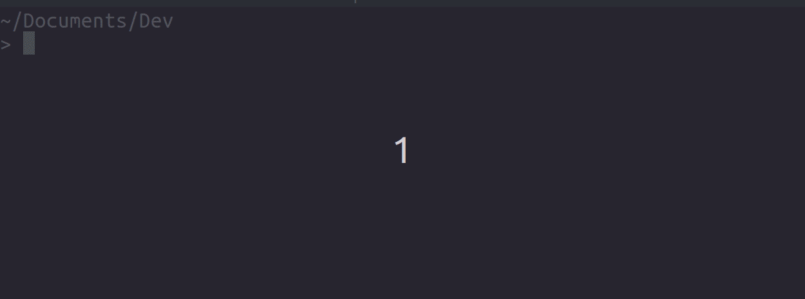

# PSUnixUtilCompleters

PowerShell parameter completers for native commands on Linux and macOS.

This module uses completers supplied in traditional Unix shells
to complete native utility parameters in PowerShell.



Currently, this module supports completions from zsh and bash.
By default it will look for zsh and then bash to run completions
(since zsh's completions seem to be generally better).

## Basic usage

To enable unix utility completions,
install this module and add the following to your profile:

```powershell
Import-Module PSUnixUtilCompleters
```

This will register argument completers for all native commands
found in the usual Unix util directories.

Given the nature of native completion results,
you may find this works best with PSReadLine's MenuComplete mode:

```powershell
Import-Module PSUnixUtilCompleters

Set-PSReadLineKeyHandler -Key Tab -Function MenuComplete
```

Note that this module currently exports no commands,
so will never be autoloaded;
you must load the module with `Import-Module` into your session to get completions.

## Further configuration

If you wish to set a preferred shell, you can do so by setting an environment variable:

```powershell
$env:COMPLETION_SHELL_PREFERENCE = 'bash'

# OR

$env:COMPLETION_SHELL_PREFERENCE = '/bin/bash'

Import-Module PSUnixUtilCompleters
```

Note that you must do this before you load the module,
and that setting it after loading will have no effect.

If you want to change the completer after loading,
you can do so from PowerShell like so:

```powershell
$zshCompleter = [PSUnixUtilCompleters.ZshUtilCompleter]::new("/bin/zsh")
[PSUnixUtilCompleters.UnixUtilCompletion]::SetCompleter($zshCompleter)
```

You can even write your own utility completer by implementing `IUnixUtilCompleter`.

## Building the module yourself

PSUnixUtilCompleters comes with a PowerShell build script,
which you can invoke to build the module yourself with:

```powershell
./build.ps1 -Clean
```

This will output the built module to `out/PSUnixUtilCompleters`.

## Credits

All the zsh completions provided by this module are made possible
by the work of [@Valodim](https://github.com/Valodim)'s zsh completion project,
[zsh-capture-completion](https://github.com/Valodim/zsh-capture-completion),
which this module invokes to get completion results.

The bash completions provided by this module are adapted from the work
done by [@mikebattista](https://github.com/mikebattista) for his
[PowerShell-WSL-interop](https://github.com/mikebattista/PowerShell-WSL-Interop) PowerShell module.
